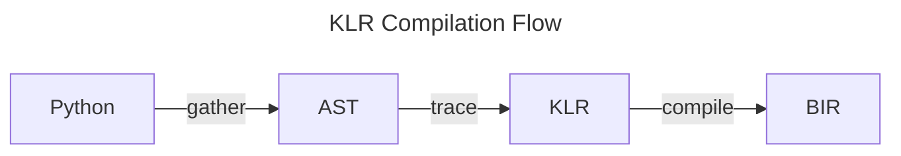

# Getting Started with KLR

This guide will help you get started using or developing KLR. If you are not a
KLR developer, and simply want to use KLR, then follow the
[Quick Start](#quick-start) section below. If you would like to build KLR
from sources, or start developing KLR itself, follow the
[Quick Start for Developers](#quick-start-for-developers) section. For a
description of how KLR works, see the [Overview of KLR](#overview-of-klr) section.

## Quick Start

The easiest way to get started using KLR is to install the python package
using `pip`:

```
pip install klr-lang
```

Once installed you should have the KLR command-line interface (CLI) and the
python API. You can check that the CLI is properly installed by executing it.
If successful, you should see help text similar to that shown below:

```
# python -m klr
klr [0.0.7]
KLR is an IR for NKI and other tensor-like languages in Lean.

USAGE:
    klr [SUBCOMMAND] [FLAGS]

FLAGS:
    -h, --help  Prints this message.
    --version   Prints the version.

SUBCOMMANDS:
    compile     Compile Python to BIR
    gather      Gather Python sources into an AST file
    nki-to-klr  Compile NKI kernel to KLR
    parse-ast   Parse Python AST file
    parse-klr   Display information about a KLR file
    parse-bir   Parse a BIR Json file
    trace       Trace Python to KLR
    trace-api   Trace Python to KLR (API version)
```

To check that the Python API is properly installed, you can try to import
the `klr` package. The command below will not return any errors if the API
is installed properly:

```
python -c "import klr"
```

### Using the Python API

To demonstrate the Python API, we will use the NKI kernel function below.
This kernel takes a single argument which is a tensor on the shared
[HBM memory](https://awsdocs-neuron.readthedocs-hosted.com/en/latest/general/arch/neuron-hardware/trainium2.html).
This tensor is copied to the internal
[SBUF memory](https://awsdocs-neuron.readthedocs-hosted.com/en/latest/general/arch/neuron-hardware/neuron-core-v3.html)
using the `load` function (note: we assume the input tensor is not too
large). The kernel then allocates a new tensor on the HBM memory of the same
size and type as the input tensor using `ndarray`.
Finally, the kernel copies the SBUF tensor to the new HBM location and
returns the new HBM tensor.

```python
def test_kernel(tensor):
  tile = nki.language.load(tensor)
  copy = nki.language.ndarray(tensor.shape, tensor.dtype, nki.language.shared_hbm)
  nki.language.store(copy, tile)
  return copy
```

To follow along, copy the code above into a new file called `test.py`. Note,
you do not need to `import` the `nki` modules for this simple example.

The core KLR API is designed to translate kernel functions, like the example
above, to KLR. The process happens in two steps. First, a kernel is specialized
to specific arguments. Each invocation of a kernel function will have a unique
KLR artifact. Second, the specialized kernel function is lowered to KLR and the
result serialized to a file. We can accomplish these two steps using the KLR
API by adding the following to our `test.py` file.

```python
if __name__ == "__main__":
  import klr
  import numpy
  tensor = numpy.ndarray((10,10), dtype=numpy.float32)

  # Create KLR kernel object for test_kernel
  kernel = klr.Kernel(test_kernel)

  # Specialize to the argument tensor
  kernel.specialize(tensor)

  # Trace the kernel function lowering to KLR
  file, warnings = kernel.trace()

  print("output file:", file)
  print(warnings)
```

This code will create a KLR kernel object `klr.Kernel` giving it our python
function `test_kernel`. Then, the arguments we want to specialize to are given
to the KLR kernel object with the `specialize` method. Finally, we `trace` the
kernel and produce a KLR asset. The result of the `trace` method is a tuple
containing the filename which contains the KLR kernel asset, and warnings
generated by the tracing process. If you execute `test.py`, you will see a
result similar to:

```
# python test.py
output file: ./fe02c9efcac88835.klr
```

In this case, there are no warnings and the KLR asset has been stored in the
file `fe02c9efcac88835.klr`.

#### Using the function decorator

The `specialize` and `trace` steps above can be automated using the `klr`
decorator. The example above could also be written as:

```python
from klr import klr

@klr
def test_kernel(tensor):
  ... # same as above

if __name__ == "__main__":
  import numpy
  tensor = numpy.ndarray((10,10), dtype=numpy.float32)
  print("output file:", test_kernel(tensor))
```

The `@klr` decorator is equivalent to using the `klr.Kernel` class. Note,
however, the `@klr` decorator is incompatible with the command-line tools.

### Using the CLI

The command-line interface is an alternative method to generate KLR from Python
source kernels. If you have installed `klr-lang` through `pip`, then you can use
the CLI to generate a KLR kernel using the `nki-to-klr` command.

```
# python -m klr nki-to-klr test.py test_kernel -o test_kernel.klr
# python -m klr parse-klr test_kernel.klr
```

The first command translates the function `test_kernel` in the `test.py` file to
KLR and stores the result in the `test_kernel.klr` file. The second command
shows a human-readable summary of the contents of the KLR file. Many more CLI
commands are available, and are documented below.

## Quick Start for Developers

The KLR language is implemented in [Lean](https://lean-lang.org/) and
[Python](https://www.python.org/). As of this writing, KLR requires Lean version
4.16 or higher, and Python version 3.8 or higher.

To setup Lean, follow the official
[lean setup instructions](https://lean-lang.org/download/).
It is highly recommended to configure
[Elan](https://github.com/leanprover/elan)
the Lean tool-chain manager (similar to `rustup`). If you have `elan`
setup, then the correct tool-chain will automatically be configure
during the KLR compilation process.

### Building from Source

Once you have Lean and Python configured, you can compile and run KLR from the
official source tree:

```
# git clone https://github.com/leanprover/KLR
# cd KLR
# lake exe klr
```

All of the CLI commands described below can be run using `lake exe klr`.

## Overview of KLR

The overall KLR compilation flow is divided into three steps: gather, trace, and
compile.



1. The **gather** step parses the Python kernel function, and recursively finds
   and parses all of the dependencies of the original function and its
   dependencies. As much as possible, the gather step will not fail, but simply
   records any missing dependencies and allows the tracing step to generate
   semantic errors.
2. The **trace** step translates the Python AST to a KLR function by partially
   evaluating the python code. The semantics of NKI kernels is defined by the
   translation to KLR implemented in the trace step.
3. The **compile** step lowers a KLR function to the back-end compiler IR.

### Step-by-step compilation with the CLI

The CLI offers commands for each step of the compilation flow. A kernel can be
compiled step-by-step, allowing inspection of each intermediate form, using
these commands.

#### Gather

The first command is `klr gather`, which generates an AST file from the original
python sources.

```
# klr gather test.py test_kernel
```

If this command is successful, it will write the file `test_kernel.ast`. The
output location of the `gather` command (and all other commands described in
this section) can be changed with `-o` flag.

Once generated, the AST file can be examined with the `parse-ast` command. By
default, the `parse-ast` command outputs a summary of the kernel AST, as shown
below. The full AST can be output by supplying the `--verbose` flag.

```
# klr parse-ast test_kernel.ast
AST summary for kernel test.test_kernel
Source Functions: test.test_kernel
Globals: nki,test.test_kernel
Undefined names [nki]
```

#### Trace

The second command `klr trace` translates a Python AST file to KLR by partially
evaluating the Python code.

```
# klr trace test_kernel.ast
```

If successful, this command will produce a file called `test_kernel.klr`
containing KLR serialized form.

Once generated, the KLR file can be examined with the `parse-klr` command.

```
# klr parse-klr test_kernel.klr
```

For convenience, there is also a `klr nki-to-klr` command that combines the
gather and trace steps into one.

```
# klr nki-to-klr test.py test_kernel
```

If successful, the above command will produce a file called `test_kernel.klr`.
This is equivalent to running `klr gather` followed by `klr trace`, but no
intermediate AST file is created.

#### Compile

The third command `klr compile` compiles a KLR file.

```
# klr compile test_kernel.klr
```

If successful, this command will produce a file called `test_kernel.bir`
containing the result of compilation.

Once generated, the BIR file can be examined with the `parse-bir` command.

```
# klr parse-bir test_kernel.bir
```

## Overview of the Source Tree

The high-level organization of the KLR source tree is:

- **interop** Python code implementing the gather step
- **KLR/Python** Lean representation of the Python AST
- **KLR/Core** The definition of the KLR Core language
- **KLR/Trace** Implementation of the trace step
- **KLR/BIR** Implementation of the compile step
- **Main.lean** The CLI driver
