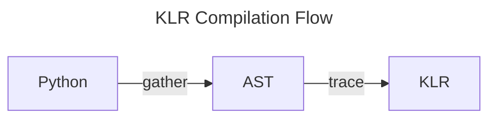

# Getting Started with KLR

This guide will help you get started using or developing KLR. If you are not a
KLR developer, and simply want to use KLR, then follow the
[Quick Start](#quick-start) section below. If you would like to build KLR
from sources, or start developing KLR itself, follow the
[Quick Start for Developers](#quick-start-for-developers) section. For a
description of how KLR works, see the [Overview of KLR](#overview-of-klr) section.

## Quick Start

The easiest way to get started using KLR is to install the python package
using `pip`:

```
pip install klr-lang
```

Once installed you should have the KLR command-line interface (CLI) and the
python API. You can check that the CLI is properly installed by executing it.
If successful, you should see help text similar to that shown below:

```
# klr
klr [0.0.11]
KLR is an IR for NKI and other tensor-like languages in Lean.

USAGE:
    klr [SUBCOMMAND] [FLAGS]

FLAGS:
    -h, --help  Prints this message.
    --version   Prints the version.

SUBCOMMANDS:
    eval-klr    Evaluate a kernel using a pure-Lean KLR interpreter. Outputs one
                npy file for each output.
    gather      Gather Python sources into an AST file
    info        Display information about a KLR file
    nki-to-klr  Compile NKI kernel to KLR
    trace       Trace Python to KLR
    typecheck   Run the type checker on a Python AST file
```

To check that the Python API is properly installed, you can try to import
the `klr` package. The command below will not return any errors if the API
is installed properly:

```
python -c "import klr.frontend"
```

### Using the Python API

To demonstrate the Python API, we will use a simple function that adds two
numbers. To follow along, copy the code below into a new file called `test.py`.

```python
def kernel_function(a, b):
  return a + b
```

The core KLR API is designed to translate kernel functions, like the example
above, to KLR. The process happens in two steps. First, a kernel constructed
and specialized to specific arguments. Second, the specialized kernel function
is lowered to KLR and the result serialized to a file. We can accomplish these
two steps using the KLR API by adding the following to our `test.py` file.

```python
if __name__ == "__main__":
  import klr.frontend as fe

  # Create KLR kernel object for kernel function
  kernel = fe.Kernel(kernel_function)

  # Specialize to specific arguments
  kernel.specialize(1, 2)

  # Serialize the result
  ba = kernel.serialize("kernel.klr")
```

This code will create a KLR kernel object from our python function `kernel`.
Then, the arguments we want to specialize to are given to the KLR kernel object
with the `specialize` method. Finally, we serialize the kernel and call-site to
produce a KLR asset. The `serialize` method create two things: a file (in this
case called "kernel.klr") that contains the KLIR of the original function
`kernel`, and a byte array, `ba`, containing information about the
specialization (a.k.a. call-site) of the kernel function.

The serialized artifacts can be loaded in using the `deserialize` function. For
example, you can add the following lines to `test.py` to read the KLR
artifacts:

```
  # get a KLR abstract snytax tree
  import klr.ast_nki
  ast = fe.deserialize(ba)
```

### Using the CLI

The command-line interface is an alternative method to generate KLR from Python
source kernels. If you have installed `klr-lang` through `pip`, then you can
use the CLI to generate a KLR kernel using the various sub-commands.

```
# klr gather test.py test_kernel -o test_kernel.klr
# klr trace test_kernel.klr
```

The CLI can also be used to inspect the KLR artifacts generated by the Python API.

```
# klr info kernel.klr
```

## Quick Start for Developers

The KLR language is implemented in [Lean](https://lean-lang.org/) and
[Python](https://www.python.org/). As of this writing, KLR requires Lean
version 4.20 or higher, and Python version 3.9 or higher.

To setup Lean, follow the official
[lean setup instructions](https://lean-lang.org/download/).
It is highly recommended to configure
[Elan](https://github.com/leanprover/elan)
the Lean tool-chain manager (similar to `rustup`). If you have `elan`
setup, then the correct tool-chain will automatically be configure
during the KLR compilation process.

### Building from Source

Once you have Lean and Python configured, you can compile and run KLR from the
official source tree:

```
# git clone https://github.com/leanprover/KLR
# cd KLR
# lake exe klr
```

You will also need to build a local version of the Python extension library for
your version of Python. For example:

```
# cd interop/klr
# make PY_VER=3.10
```

Once complete, all of the CLI commands described below can be run using either
`lake exe klr` or `./bin/klr` from the root of the source tree.

## Overview of KLR

The overall KLR compilation flow is divided into three steps: gather, trace, and
compile.



1. The **gather** step parses the Python kernel function, and recursively finds
   and parses all of the dependencies of the original function and its
   dependencies. As much as possible, the gather step will not fail, but simply
   records any missing dependencies and allows the tracing step to generate
   semantic errors.
2. The **trace** step translates the Python AST to a KLR function by partially
   evaluating the python code. The semantics of NKI kernels is defined by the
   translation to KLR implemented in the trace step.
3. The **compile** step lowers a KLR function to the back-end compiler IR.

### Step-by-step compilation with the CLI

The CLI offers commands for each step of the compilation flow. A kernel can be
compiled step-by-step, allowing inspection of each intermediate form, using
these commands.

#### Gather

The first command is `klr gather`, which generates an AST file from the original
python sources.

```
# klr gather test.py test_kernel
```

If this command is successful, it will write the file `test_kernel.ast`. The
output location of the `gather` command (and all other commands described in
this section) can be changed with `-o` flag.

Once generated, the AST file can be examined with the `parse-ast` command. By
default, the `parse-ast` command outputs a summary of the kernel AST, as shown
below. The full AST can be output by supplying the `--verbose` flag.

```
# klr parse-ast test_kernel.ast
AST summary for kernel test.test_kernel
Source Functions: test.test_kernel
Globals: nki,test.test_kernel
Undefined names [nki]
```

#### Trace

The second command `klr trace` translates a Python AST file to KLR by partially
evaluating the Python code.

```
# klr trace test_kernel.ast
```

If successful, this command will produce a file called `test_kernel.klr`
containing KLR serialized form.

Once generated, the KLR file can be examined with the `parse-klr` command.

```
# klr parse-klr test_kernel.klr
```

For convenience, there is also a `klr nki-to-klr` command that combines the
gather and trace steps into one.

```
# klr nki-to-klr test.py test_kernel
```

If successful, the above command will produce a file called `test_kernel.klr`.
This is equivalent to running `klr gather` followed by `klr trace`, but no
intermediate AST file is created.

#### Compile

The third command `klr compile` compiles a KLR file.

```
# klr compile test_kernel.klr
```

## Overview of the Source Tree

The high-level organization of the KLR source tree is:

- **interop** Python code implementing the gather step
- **KLR/Python** Lean representation of the Python AST
- **KLR/Core** The definition of the KLR Core language
- **KLR/Trace** Implementation of the trace step
- **Main.lean** The CLI driver
